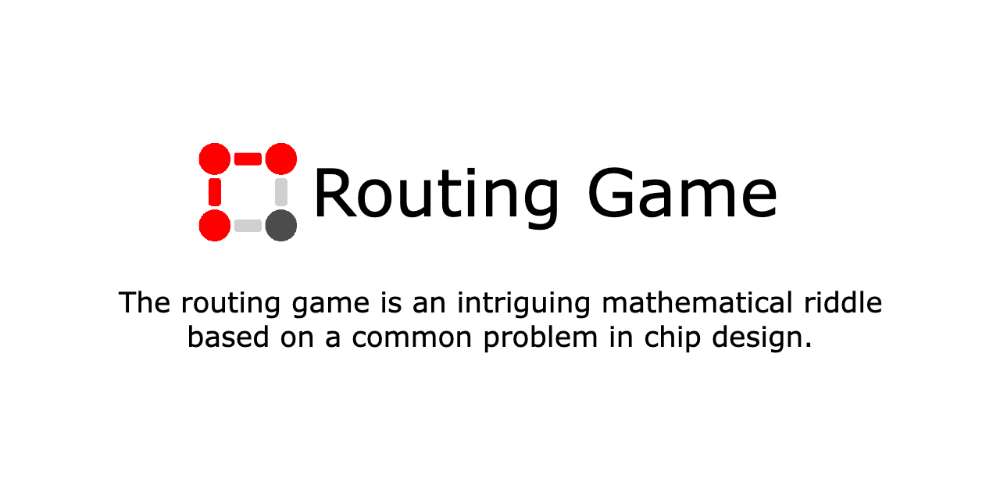

# Routing Game

The routing game originates from a common problem in chip design. Your task is to connect all pins on a grid with a limited number rods. Finding a solution with an additional rod is easy. Will you be able to solve this intriguing mathematical riddle?

Play it online at [rtng.schln.de](https://rtng.schln.de)!


## Local Development

To run the game on you machine, make sure you have [npm installed](https://nodejs.org/en/download).

1. Start webpack in watch mode to compile any changes in the source code:
   ```bash
   npm run watch
   ```
2. Start a web server to host the game in a separate shell:
   ```bash
   npm run serve
   ```
3. The game is then served at: [localhost:8080](http://localhost:8080)
